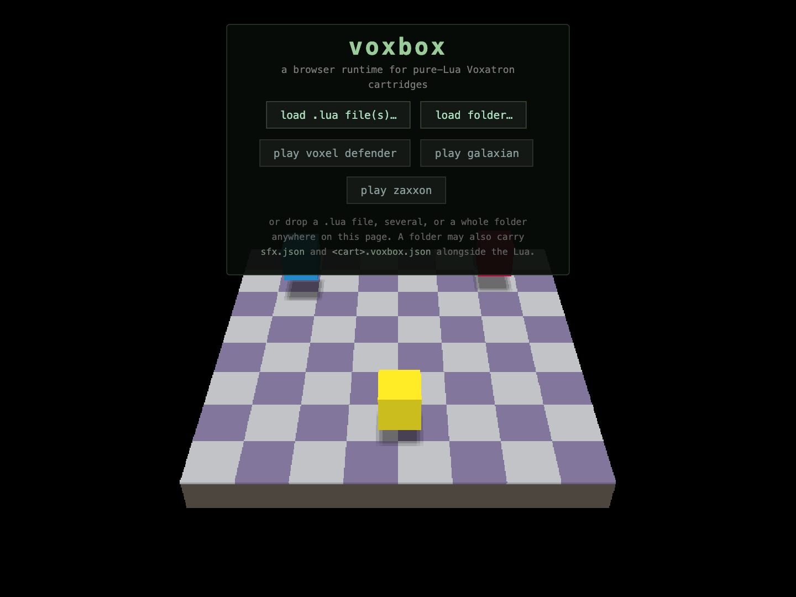
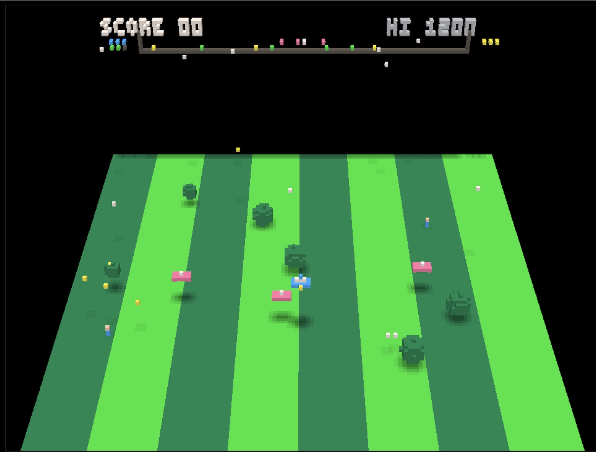
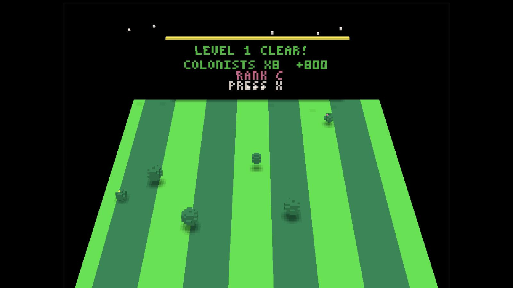
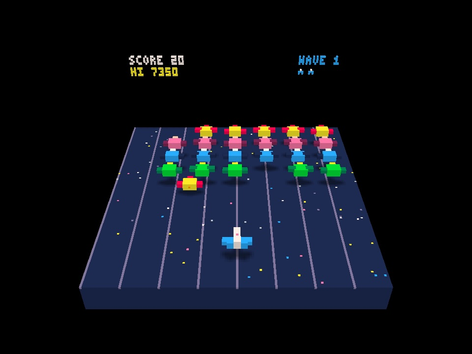
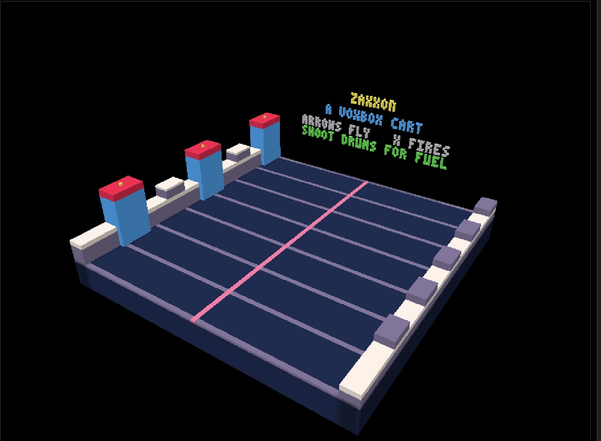
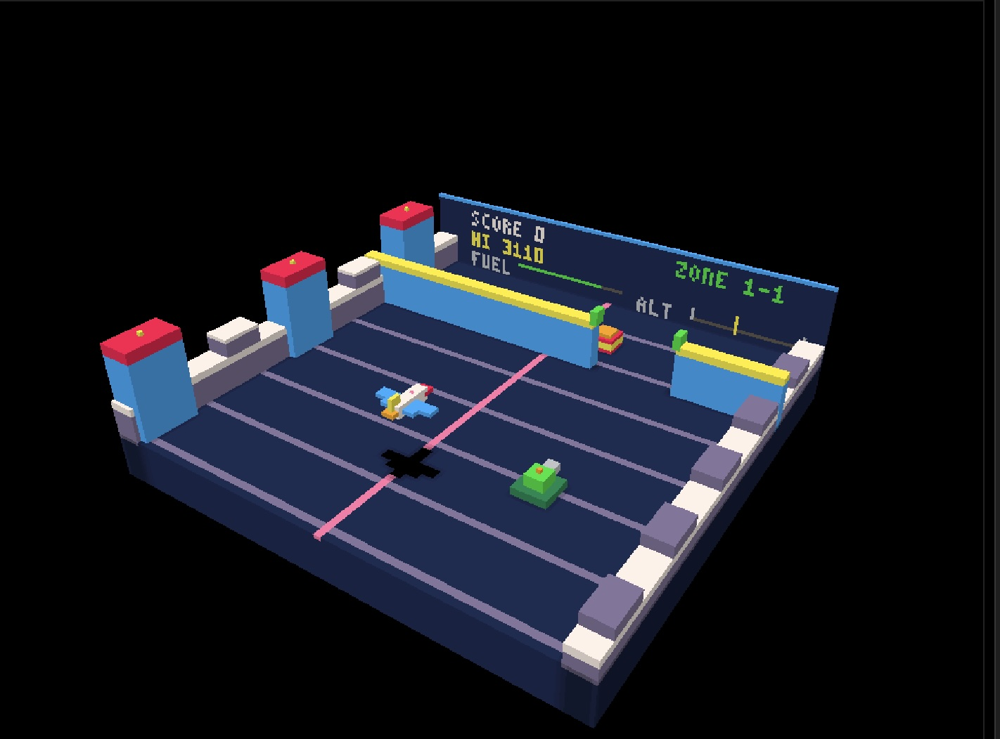
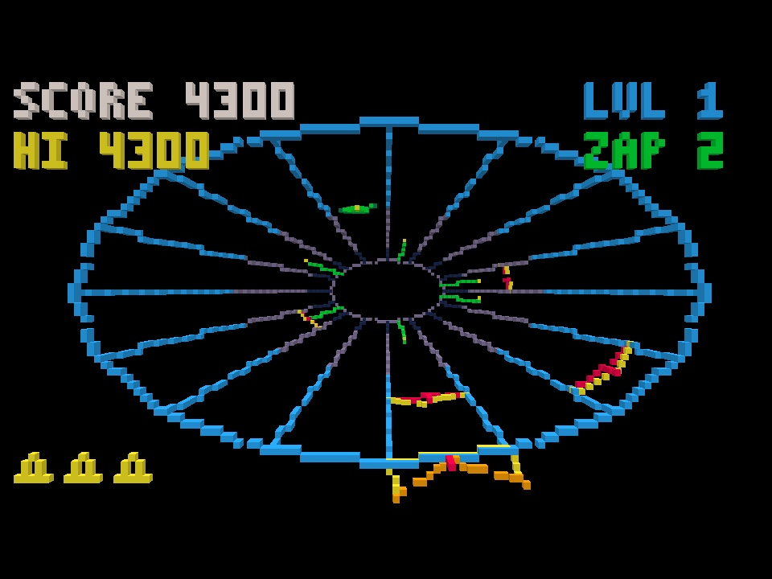
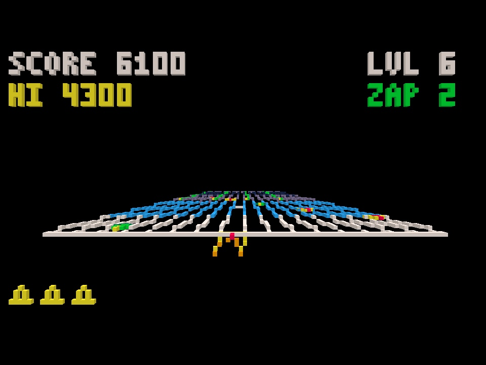

# voxbox

A browser runtime for pure-Lua Voxatron cartridges. Hand it a `.lua` file and it
loads, runs, and makes noise — no Voxatron install, no build step, no server-side
anything beyond a static file server.



Voxatron draws into a 128 × 128 × 64 voxel volume. voxbox reimplements that
volume and its drawing API in JavaScript, runs the cart's Lua under a
WebAssembly Lua 5.4 VM, and raymarches the result on the GPU with per-face
shading and drop shadows. The screen above is live — that idle slab is the real
renderer, running before any cart is loaded.

It is **self-contained**: clone it, run it, and all three bundled games work.

---

## Quick start

```bash
python3 app.py
```

Then open <http://localhost:8080/>. You land on the launcher shown above.

Playing needs only Python 3 and Flask — the routes it uses just serve files, and
the Lua VM is vendored, so there is no `npm install`. The development tools want
two more: `lupa` for the conformance oracle and `numpy` for the reference audio
renderer.

---

## The bundled games

Four carts ship with voxbox, all written in pure Voxatron Lua.

### Voxel Defender

A Defender-style rescue shooter across a wrapping 512-voxel world: fly, shoot
landers, stop your colonists being abducted, and land on the pads to deliver
them. Ten levels with per-level palettes and hazards.



The HUD, radar and menus are painted onto the back wall of the volume with
`set_draw_slice` — the score, the radar strip with its blips, and the spare-ship
pips are all voxels, not an overlay.



### galaxian

A Galaxian clone written as a worked example of a cart the engine did **not**
grow up around. The formation hangs at the back and sways; attackers peel off
one at a time and weave down at you, firing as they come, then loop round the
back to rejoin. Waves get more aggressive; the hiscore is saved through
`cartdata`/`dget`/`dset` like a real Voxatron cart.



Every sound it makes is **synthesised from the sound's name** — no audio was
authored for it at all. See [Sound](#sound) below.

### zaxxon

An isometric-shooter homage where **altitude is the whole game**. A fortress
deck scrolls toward you; you hold station near the front and fly across and up
and down, threading the gaps in walls or clearing them over the top, shooting
turrets and enemy planes, and blasting fuel drums before the tank runs dry.
Zones cycle fortress → open space → fortress → a boss robot with a core you
have to line up on, then repeat, harder.



The camera is swung round to the genre's three-quarter angle, so the scroll
axis runs diagonally and you see the deck's flank as well as its face.
Ramparts, crenellations and beacon towers line both edges — asymmetrically,
since anything tall on the near flank would stand between you and the play
area.

It leans on something the engine gives away for free: **your ship's drop shadow
slides along the deck underneath you, and that shadow is the altitude gauge** —
the way the genre always intended it to be read. There is a ladder on the back
wall too, but the shadow is the one you actually fly by. In the space zones
there is no deck, so the engine finds no ground plane and the shadow correctly
disappears.



Above: the ship is climbing, and its shadow has fallen well behind it on the
deck — that gap *is* the altitude reading. The score, fuel and altitude ladder
are voxels on a board standing at the far end of the run, not an overlay.

### tempest

A Tempest homage, and the only bundled cart played **down** the depth axis
rather than across the floor. The web is a tube running from the far wall to
just in front of the camera; the claw rides the near rim and everything climbs
toward you. Flippers walk up the lanes and, if they reach the rim, come along it
after you; tankers split when shot; spikers lay the spikes you have to clear
before the dive to the next level. Two superzapper charges a level, the first
clearing the web and the second taking a single enemy, as the cabinet did.



The tube is tapered as well as drawn in perspective, so the far mouth ends up
about a fifth the size of the near rim. That taper matters: the renderer has no
distance fog, so without it a straight tube reads as a flat ring. The other half
of the depth cue is in the cart — every radial edge is drawn in five bands that
brighten toward the player, which is what Tempest's coloured webs were doing
anyway.

Six web shapes cycle with the level — circle, square, V, star, cross and a flat
open field — each generated from a corner list rather than drawn by hand. Open
shapes have walls the claw cannot rotate past; closed ones wrap.



---

## Loading your own cart

From the launcher, or the **cart** panel while something is running:

| | |
|---|---|
| **load .lua file(s)…** | one file, or several loaded in filename order |
| **load folder…** | a whole directory, walked recursively |
| **drag and drop** | a file, several files, or a folder, anywhere on the page |
| `?cart=<url>` | load by URL, skipping the launcher |

A multi-module cart is concatenated in **filename order** — the `01_`…`09_`
prefix convention. The resolved order is listed in the panel with ▲▼ controls if
the sort ever gets it wrong. **eject** returns you to the launcher.

Loading a cart disposes the previous Lua state entirely, so it is a genuine
restart rather than a reset.

### What a cart needs

- `_init()`, `_update()` (or `_update60()` for 60 Hz), `_draw()`
- Voxatron drawing: `clv`, `vset`, `boxfill`, `sphere`, `line3d`, `box`, and
  `set_draw_slice` + `print`/`pset`/`line` for HUD work on a wall
- Input: `btn(i)` / `btnp(i)`, or Voxatron's `button(n)`
- The volume is **128 × 128 × 64 with z = 0 at the top** — worth stating
  explicitly if you are generating a cart, since it is counterintuitive

The PICO-8 standard library is implemented (`flr`, `sgn`, `rnd`, `sin`/`cos` in
turns, `add`/`del`/`all`/`foreach`, `sub`, `split`, bit ops, …). Carts run in a
sandbox with no `io`, `os`, `require`, `load` or `debug`.

### Optional sidecars

Drop these alongside `mygame.lua` (or serve them next to it):

- **`mygame.voxbox.json`** — display name, camera, controls, persisted globals
- **`mygame.sfx.json`** — a hand-authored sound pack

```json
{
  "name": "My Game",
  "controls": [["arrows", "move"], ["x", "fire"]],
  "camera": { "pos": [64, 252, -98], "target": [64, 66, 40], "fov": 42 },
  "groundZ": 50
}
```

See [carts/galaxian.voxbox.json](carts/galaxian.voxbox.json) for a commented
example. Everything is optional; the engine has sensible defaults for all of it.

---

## Sound

In a real Voxatron cart the sounds live in the `.vx.png` resource tree, not the
Lua — so given a `.lua` file, **the audio data is not in the input**. But
Voxatron looks audio up *by name*, and a missing name is silence rather than an
error, so voxbox is free to decide what a name means.

It resolves each name three ways, in order:

1. **authored** — a pack you supplied
2. **generated** — a spec synthesised from the name: a keyword lexicon picks an
   archetype (`shoot|laser|pew` → pulse downslide, `boom|explo|die` → noise
   burst, `coin|pickup` → rising blip…) and a hash of the name varies it, so
   `boom` and `bigboom` differ and both sound the same on every machine
3. **silent** — which is exactly what Voxatron itself does

The audio panel colours every name the cart requested by which of those it got.
Because the generator emits **specs rather than PCM**, **export sfx.json** hands
you an editable pack to tweak and ship back — auto-synthesis is the first draft
of authoring, not a substitute for it.

Music defaults to silent because generated loops grate far more readily than
generated one-shots; `?automusic=1` turns it on.

---

## While a cart is running

The **api** panel is the first place to look when something misbehaves:

- *all called API implemented* — the engine has everything the cart asked for
- **amber** — called but unimplemented; only visuals or audio are missing
- **red** — a function whose *return value* the cart uses, which the engine is
  faking, so the game is genuinely misbehaving
- **undeclared** + **stub & restart** — the cart called something not in the API
  manifest at all; one click stubs it and reloads so you can get further

Lua errors pause the loop and show the traceback rather than spinning.

### Keys

<kbd>esc</kbd> pause menu (resume / quit) · <kbd>p</kbd> quiet pause ·
<kbd>n</kbd> step one frame · <kbd>m</kbd> mute music. Gamepads use the standard
mapping; touch controls appear on touch devices. Per-cart controls are listed in
the panel, from the cart's own manifest.

### URL options

| | |
|---|---|
| `?cart=<url>` | load a cart directly, skipping the launcher |
| `?sfx=<url>` | use a specific sound pack |
| `?automusic=1` | generate music as well as sound effects |
| `?autosfx=0` | silence unknown sounds instead of generating them |
| `?cam=x,y,z&tgt=x,y,z&fov=n` | override the camera |
| `?ground=50` / `?ground=off` | pin or disable the drop-shadow plane |
| `?touch=1` | force the touch overlay on |

---

## Layout

```
app.py                  flask dev server (localhost:8080)
carts/                  bundled carts + their .voxbox.json sidecars
shim/picovox.lua        canonical Voxatron/PICO-8 API, deterministic across VMs
shim/api.lua            API manifest: sandbox allowlist + per-name stub policy
shim/sandbox.lua        cart environment builder + recording stubs
shim/driver.lua         scripted input session for conformance runs
runtime/index.html      the page
runtime/js/host.js      shell + per-cart session, loader, panels, frame loop
runtime/js/volume.js    the voxel volume and every drawing primitive
runtime/js/render.js    WebGL2 raymarcher
runtime/js/sfxgen.js    sound name -> spec (keyword archetypes + name hash)
runtime/js/synth.js     spec -> PCM
tools/trace_run.py      Python oracle (lupa)
tools/conform.py        trace differ
tools/sfxgen.py         reference audio renderer, WAV previews
tools/import_cart.py    pull a cart in from an external source tree
docs/                   development notes and design plans
```

---

## Development

voxbox keeps a **bit-exact conformance harness**: the same cart, shim and
scripted input run under both Python/lupa and the browser's wasmoon, and their
draw/audio traces are compared line by line.

```bash
python3 tools/trace_run.py --frames 4000        # oracle  -> trace_py.txt
open http://localhost:8080/conform?frames=4000  # browser -> trace_js.txt
python3 tools/conform.py trace_py.txt trace_js.txt
```

4000 frames is 631,810 trace lines, and they match exactly. Anything that
changes rendering or Lua semantics should keep it that way.

To pull in a cart maintained in another source tree:

```bash
python3 tools/import_cart.py ../some-game/src --name some-game
```

Further reading in [docs/](docs/):

- [DEVELOPMENT.md](docs/DEVELOPMENT.md) — phase-by-phase status, the determinism
  rules that make bit-exact traces possible, and detailed notes
- [VOXBOX_ENGINE_PLAN.md](docs/VOXBOX_ENGINE_PLAN.md) — the original engine plan
- [VOXBOX_GENERIC_PLAN.md](docs/VOXBOX_GENERIC_PLAN.md) — the plan for making it
  run any cart, with the findings from doing so
